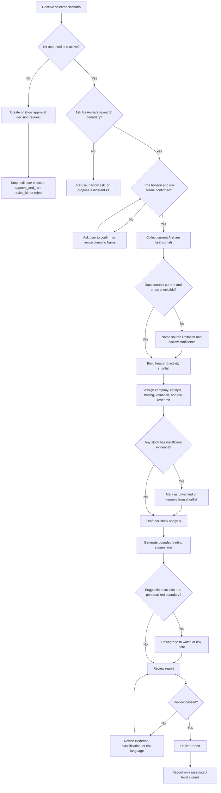

# A-Share Hot Stock Research Flow

## Purpose

Analyze currently active A-share stocks using verified public information, recent market heat, and trading activity, then produce a research report with bounded, non-personalized trading suggestions.

## Input

- A concrete A-share market research ask.
- Confirmed time horizon and risk frame.
- Required output format and depth.
- Publicly verifiable market data, company data, and news sources.

## Flow Map

## Steps

1. Read `ENTRY.md`.
2. Confirm `kit.json` status is `active` and `build_approval.status` is `approved`.
3. Confirm the selected scenario: A-share market, recent heat and trading activity, 1 to 4 week time horizon, medium risk frame, information report plus bounded trading suggestions.
4. Collect current market heat signals from public sources, prioritizing current trading activity, turnover, market attention, sector catalysts, and recent price movement.
5. Build a shortlist of 8 to 12 stocks when enough verified data is available.
6. Resolve roles from `ROLES.json`.
7. Select concrete mates from `ROSTER.json`.
8. Execute assignments:
   - heat screening
   - company and catalyst research
   - trading activity and technical context
   - valuation and financial context
   - risk review
   - report synthesis
9. Cross-check names, tickers, prices, dates, catalysts, and public claims.
10. Classify each stock with one bounded suggestion:
    - `watch`
    - `buy_on_pullback`
    - `hold`
    - `take_profit_or_reduce`
    - `avoid`
11. Review the report for factual support, boundary fit, and usefulness.
12. Return the report.
13. Record only meaningful level signals.

## Output

- Markdown information report.
- Optional CSV table of stock shortlist and classifications.
- Optional JSON summary of evidence confidence and suggestion categories.

## Approval

Stop and ask for approval before:

- running this newly generated kit
- expanding into personalized portfolio advice
- recommending leverage, full-position, or single-stock heavy-position behavior
- using non-public information
- automating trading or order execution

Create a choice gate and wait for the user decision.
