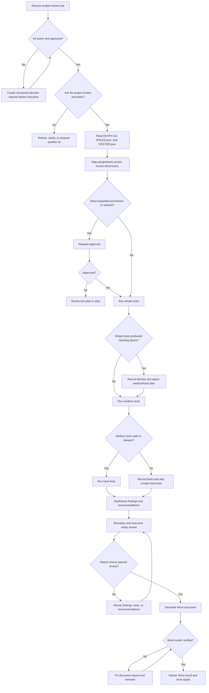

# Askdo Project Review Flow

## Purpose

Review the Askdo project from multiple dimensions, run simple, medium, and hard tests, and produce a Word report with results and optimization recommendations.

## Inputs

- User ask and target workspace.
- Review dimensions and priorities.
- Required report format: Word document.
- Known execution limits or approvals.

## Flow Map

## Steps

1. Start from `ENTRY.md`.
2. Confirm the kit is active, approved, and in boundary.
3. Resolve review roles from `ROLES.json` and active mates from `ROSTER.json`.
4. Build a test plan across simple, medium, and hard levels.
5. Run simple tests first to check source structure, required files, schema parseability, and public product consistency.
6. Run medium tests to check kit lifecycle, entry approval gates, role and roster consistency, flow maps, and existing kit reuse.
7. Run hard tests to stress execution boundaries, scenario reuse, destructive-action safeguards, Word delivery readiness, and product coherence.
8. If a lower level exposes a blocking failure, record it and adjust later tests to stay safe.
9. Synthesize findings by dimension, severity, evidence, and recommended fix.
10. Review source conclusions for boundary safety and executive clarity.
11. Generate a Word document after conclusions are stable.
12. Render and verify the Word document before delivery.
13. Return the Word document path and a short result summary.
14. Record only meaningful level signals.

## Test Levels

### Simple

- Required file and directory checks.
- JSON parse checks.
- Public terminology checks.
- Generated kit source file checks.

### Medium

- Schema conformance checks.
- `ENTRY.md` approval gate checks.
- `FLOW.md` decision-gate and revision-loop checks.
- `ROLES.json` and `ROSTER.json` consistency checks.
- Existing kit lifecycle and reuse checks.

### Hard

- Boundary and approval stress tests.
- Scenario-binding reuse tests.
- Roster mutation and role-contract decoupling tests.
- Delivery pipeline test for Word output.
- Product coherence review against Askdo design promises.

## Review

- Findings must include evidence and severity.
- Recommendations must be actionable and prioritized.
- The Word document must not change source conclusions during delivery formatting.
- Unsafe tests must be skipped with a clear reason rather than forced.

## Output

- Word document containing test results and optimization plan.
- Optional Markdown source report when needed before Word delivery.

## Failure Handling

- If tests fail, include failures in the report and recommend fixes.
- If test execution is blocked by missing approval, stop and request approval.
- Record missing approval as a choice gate in `DECISION_REQUEST.md` and `DECISION_REQUEST.json`, then wait.
- If Word generation fails, preserve the reviewed Markdown source and return the blocker.
