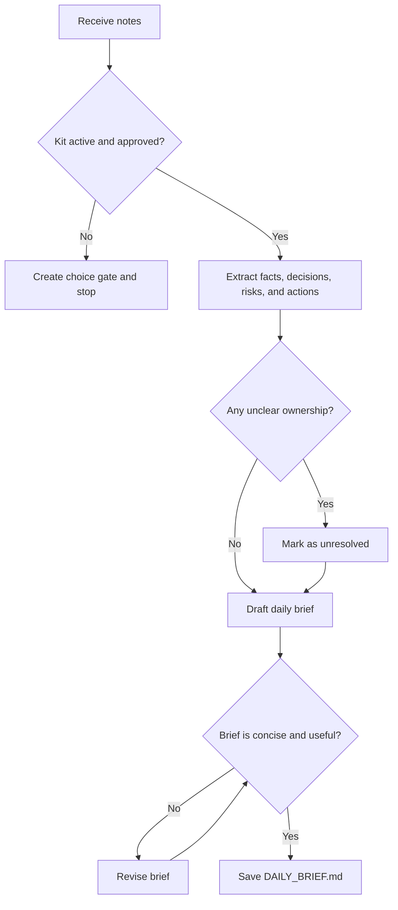

# Daily Brief Flow

## Purpose

Produce a concise daily brief from a small note set.

## Flow Map

## Steps

1. Start from `ENTRY.md`.
2. Confirm approval and boundary.
3. Extract facts, decisions, risks, and next actions.
4. Mark unknown owners or dates as unresolved.
5. Save a concise Markdown brief.

## Failure Handling

- Stop when approval is missing.
- Refuse secret extraction or unsupported external access.
