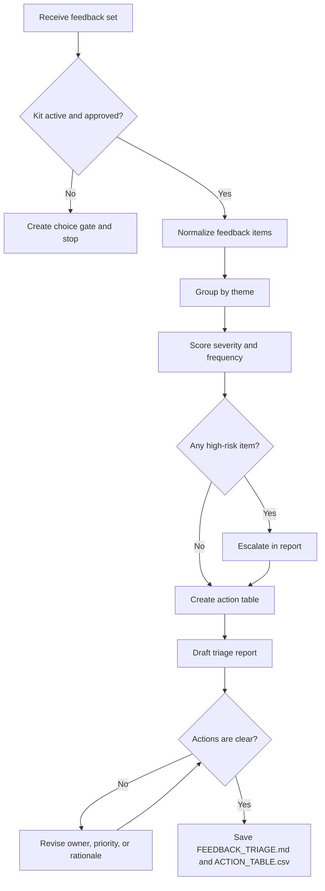

# Feedback Triage Flow

## Purpose

Classify feedback, detect themes, prioritize issues, and produce an action table.

## Flow Map

## Steps

1. Start from `ENTRY.md`.
2. Confirm approval and boundary.
3. Normalize feedback into discrete items.
4. Group items by theme.
5. Score severity and frequency.
6. Recommend priority and owner type.
7. Save a Markdown report and CSV action table.

## Failure Handling

- Stop when approval is missing.
- Redact or avoid sensitive personal data.
- Mark uncertain prioritization instead of inventing certainty.
