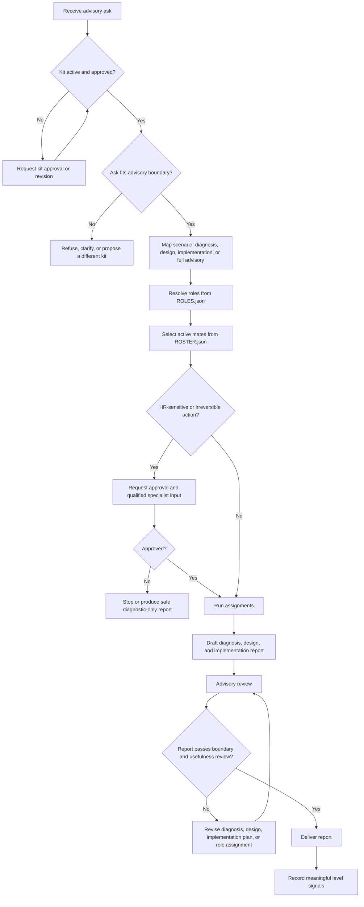

# Human Capital Advisory Flow

## Purpose

Turn a user ask into a practical human capital advisory design and execution report.

## Inputs

- User ask and target organization context.
- Desired report language, depth, and format.
- Known constraints, sensitive boundaries, or implementation risks.

## Flow Map

## Steps

1. Start from `ENTRY.md`.
2. Confirm the kit is active, approved, and in boundary.
3. Confirm the advisory boundary and avoid legal, compensation, termination, or compliance execution unless explicitly approved and supported by qualified expertise.
4. Map the ask to a scenario and run assignments.
5. Resolve roles from `ROLES.json` and active mates from `ROSTER.json`.
6. Diagnose the enterprise need across structure, roles, decision rights, talent flow, collaboration, operating cadence, and efficiency.
7. Design a tailored advisory capability model with service lines, crew, roles, mates, methods, deliverables, and governance.
8. Define a systematic implementation path with phases, artifacts, decision gates, risks, and success metrics.
9. Review the report for clarity, boundary fit, and usefulness.
10. If the report fails review, revise the diagnosis, design, implementation path, or assignment mapping before delivery.
11. Deliver the report as a Markdown result.
12. Record only meaningful level signals.

## Review

- The report must distinguish diagnosis, design, and implementation.
- The advisory model must include granular roles and mates.
- Recommendations must avoid pretending to execute legally sensitive HR actions.
- The output must be useful for a founder, operator, or executive sponsor.

## Output

- A user-facing report in Markdown.
- Optional structured source artifacts only when they add reuse value.

## Failure Handling

- If the enterprise context is too ambiguous for an implementation recommendation, produce a diagnostic-first report and list the missing inputs.
- If the ask enters high-risk HR execution, stop and request approval or qualified specialist input.
