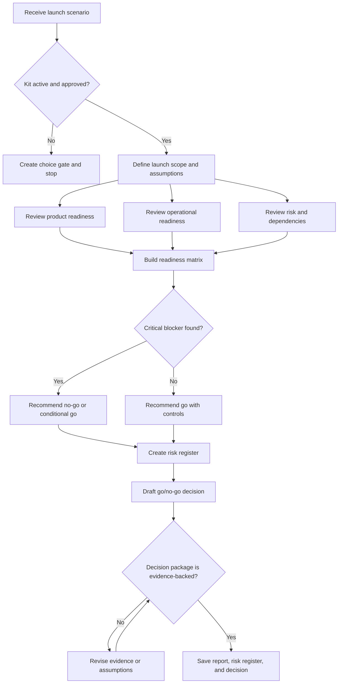

# Launch Readiness Flow

## Purpose

Assess readiness, identify blockers, and produce a decision-ready launch package.

## Flow Map

## Steps

1. Start from `ENTRY.md`.
2. Confirm approval and boundary.
3. Define launch scope, assumptions, constraints, and success criteria.
4. Review product, operational, risk, and dependency readiness.
5. Build a readiness matrix.
6. Identify blockers and mitigation actions.
7. Produce a go/no-go recommendation.
8. Save Markdown and CSV artifacts.

## Failure Handling

- Stop when approval is missing.
- Refuse actual deployment or production mutation.
- Mark unknowns as launch risks.
- Recommend conditional go or no-go when blockers remain.
