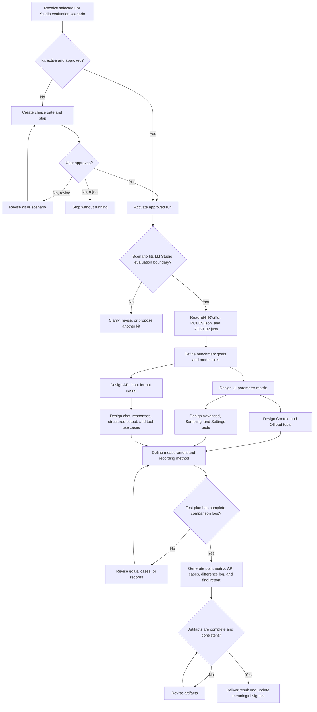

# LM Studio Evaluation Flow

## Purpose

Design and execute a complete LM Studio local model evaluation plan that covers UI parameter adjustment, API request formats, sampling behavior, context and offload behavior, advanced settings, comparison methods, and difference recording.

## Inputs

- Selected scenario: `full-lmstudio-evaluation-kit`.
- Target LM Studio version or default current-version assumption.
- Candidate local models or model slots.
- Hardware constraints when available.
- Evaluation goals and required deliverables.

## Flow Map

## Steps

1. Start from `ENTRY.md`.
2. Confirm kit status, build approval, selected scenario, and boundary.
3. Resolve active mates from `ROSTER.json` and role contracts from `ROLES.json`.
4. Define evaluation goals: quality, latency, throughput, stability, context handling, format following, and resource pressure.
5. Define model slots and hardware assumptions.
6. Build a UI parameter matrix for:
   - Context and Offload.
   - Advanced.
   - Sampling.
   - Settings.
7. Build API test cases for:
   - OpenAI-compatible chat completions.
   - OpenAI-compatible responses.
   - structured JSON output.
   - tool use and function calling.
   - streaming and non-streaming requests.
   - seed-controlled repeatability.
8. Define input formats:
   - plain prompt.
   - system and user messages.
   - multi-turn messages.
   - long-context document prompt.
   - JSON schema output request.
   - tool call request.
9. Define comparison dimensions:
   - output quality.
   - correctness.
   - instruction following.
   - JSON validity.
   - tool call validity.
   - latency and tokens per second.
   - time to first token.
   - memory or VRAM pressure when observable.
   - repeatability across seeds.
10. Define difference recording fields and scoring rubric.
11. Generate the requested Markdown, CSV, and JSON artifacts.
12. Review artifacts for completeness, feasibility, and closed-loop testing.
13. Return paths and a concise result summary.

## Parameter Coverage

### Context And Offload

- context length.
- context overflow behavior.
- GPU offload ratio or layer allocation where available.
- CPU threads.
- KV cache precision or quantization where available.
- model residency or keep-in-memory behavior where available.

### Advanced

- RoPE frequency base.
- RoPE frequency scale.
- evaluation batch size.
- Flash Attention.
- memory mapping.
- expert count for MoE models where applicable.
- speculative decoding draft model where applicable.

### Sampling

- temperature.
- top-p.
- top-k.
- min-p.
- repeat penalty.
- frequency penalty.
- presence penalty.
- XTC probability and threshold where available.
- max tokens.
- stop strings.
- seed.

### Settings

- local server availability.
- model load and unload state.
- streaming on or off.
- structured output mode.
- tool use mode.
- logging and prompt inspection when available.
- result export and run naming convention.

## Review

- Use official LM Studio documentation as the source for supported API and parameter categories.
- Do not claim a specific UI label exists unless it is known or the user confirms the version.
- Separate load-time parameters from per-request inference parameters.
- Separate UI testing from API testing.
- Record assumptions and version sensitivity.

## Output

- `LM_STUDIO_EVALUATION_PLAN.md`: full testing plan and procedure.
- `PARAMETER_MATRIX.csv`: parameter groups, values, expected effect, risk, and measurement.
- `API_CASES.json`: request examples and expected evaluation checks.
- `DIFFERENCE_LOG.csv`: structured record template for observed differences.
- `FINAL_REPORT.md`: summarized comparison method and decision rubric.

## Failure Handling

- If approval is missing, create a choice gate and stop.
- If LM Studio version is unknown, produce a version-tolerant plan and mark UI labels as version-sensitive.
- If model or hardware data is missing, use model slots and assumptions instead of inventing specifics.
- If a requested operation needs network, installation, model download, or server startup, request separate approval.
