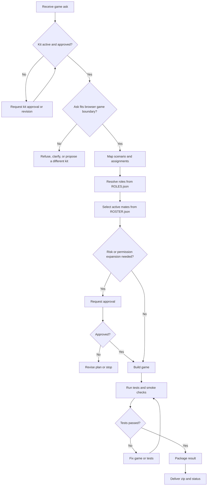

# Plane Shooter Game Flow

## Purpose

Turn a user ask for a simple plane shooter into a tested browser game package.

## Inputs

- Game theme or constraints from the user.
- Required delivery format.

## Flow Map

## Steps

1. Start from `ENTRY.md`.
2. Confirm the kit is active, approved, and in boundary.
3. Confirm the requested game boundary and delivery format.
4. Map the run into assignments owned by active mates in `ROSTER.json`.
5. Resolve roles from `ROLES.json`.
6. Define the game loop, controls, difficulty, and delivery acceptance checks.
7. Create a standalone browser game with HTML, CSS, and JavaScript.
8. Include core gameplay: player movement, shooting, enemies, collision, scoring, lives, and restart.
9. Add focused automated tests for reusable gameplay logic and static package integrity.
10. Run the tests and a browser smoke check when available.
11. If tests fail, revise implementation or tests and rerun before packaging.
12. Package the tested deliverable as a zip file.
13. Return the result path and test status.

## Review

- The game must run without external network dependencies.
- The package must include user-facing instructions.
- Tests must cover collision, scoring, and life-loss behavior.

## Output

- A zip file containing the game.
- A short result summary.

## Failure Handling

- If tests fail, fix the issue and rerun tests before packaging.
- If packaging fails, return the exact blocker and keep the uncompressed result folder.
