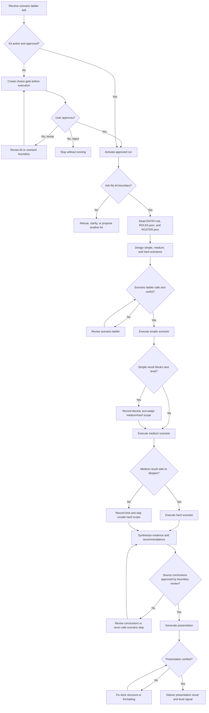

# Scenario Ladder Presentation Flow

## Purpose

Automatically design a simple, medium, and hard scenario ladder from the user ask, execute each level safely, and produce a presentation that explains the result.

## Inputs

- User ask and intended outcome.
- Workspace path or target subject.
- Required scenario levels: simple, medium, hard.
- Approval and permission limits.
- Presentation language, audience, and delivery format.

## Flow Map

## Steps

1. Start from `ENTRY.md`.
2. Confirm the kit is active, approved, and in boundary.
3. Resolve reusable roles from `ROLES.json` and active mates from `ROSTER.json`.
4. Translate the user ask into a progressive scenario ladder.
5. Define the simple scenario as the smallest useful proof of the ask.
6. Define the medium scenario as a broader workflow that combines multiple checks or roles.
7. Define the hard scenario as an end-to-end stress test with failure handling, delivery pressure, and boundary review.
8. Review the ladder for safety, usefulness, and permission needs before execution.
9. Execute the simple scenario first and capture concise evidence.
10. Execute the medium scenario only after the simple result is understood.
11. Execute the hard scenario only when the medium result is safe to deepen.
12. If a lower level blocks the next level, adapt or skip unsafe scope and record the reason.
13. Synthesize results, recommendations, and confidence by level.
14. Perform boundary review before delivery processing.
15. Generate the presentation after source conclusions are stable.
16. Verify the presentation structure and visual readability before delivery.
17. Return the presentation path and short result summary.
18. Record only meaningful level signals.

## Scenario Levels

### Simple

- One narrow scenario.
- Low-risk local evidence.
- Minimal role coordination.
- Validates the basic ask-to-result path.

### Medium

- Multi-step scenario.
- Uses several roles or mates.
- Checks flow branching, evidence quality, and recovery from ordinary failures.
- Validates that the kit can coordinate a real run.

### Hard

- End-to-end scenario.
- Includes ambiguity, branching, delivery requirements, and boundary review.
- Tests whether the result remains useful under pressure.
- Skips or adapts unsafe scope instead of forcing execution.

## Review

- The scenario ladder must be generated from the ask, not hard-coded.
- Shared roles must be reused through role archetypes and scenario bindings.
- Active mates must come from `ROSTER.json`.
- Source conclusions must be stable before presentation formatting.
- Presentation delivery must not alter the source conclusions.

## Output

- Presentation file with:
  - ask summary.
  - simple, medium, and hard scenario designs.
  - execution evidence.
  - level-by-level results.
  - recommendations and next actions.

## Failure Handling

- If build approval is missing, create a choice gate and stop.
- If a scenario is unsafe, revise or skip that part and explain why.
- If expanded permission is needed, request a separate approval.
- If presentation generation fails, preserve the reviewed source summary and return the blocker.
