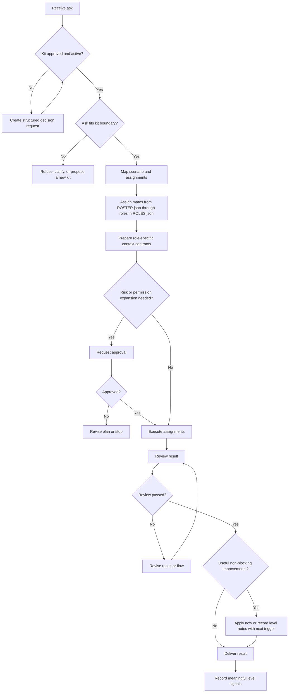

# Flow

## Purpose

<kit purpose>

## Input

- A concrete user ask.
- Constraints, desired format, and known risks.

## Flow Map

## Steps

1. Read `ENTRY.md`.
2. Confirm `kit.json` status is `active` and `build_approval.status` is `approved`.
3. Clarify only when the ask is too ambiguous to act safely.
4. Map the ask to a scenario and run assignments.
5. Resolve roles from `ROLES.json`.
6. Select concrete mates from `ROSTER.json`.
7. Prepare only the inputs allowed by each role's context contract.
8. Request approval for risk, permission expansion, or boundary expansion.
9. Execute the work.
10. Review the result for correctness, boundary fit, and usefulness.
11. If review fails, revise the plan, role assignment, result, or flow before delivery.
12. If review passes with useful non-blocking improvements, apply safe approved improvements now or record level notes with the next trigger without failing the run.
13. Return the result in the configured deliverable language when available.
14. Record only meaningful level signals.

## Output

- A useful result for the user.
- Optional Markdown, CSV, or JSON internal artifacts when needed.

## Approval

Stop and ask for approval before:

- running a newly generated kit
- high-risk, destructive, irreversible, or boundary-expanding work
- permission expansion
- material role or roster changes

Create a choice gate, record it in decision request artifacts or an adapter surface, and wait for the user decision.
